# RAEMCTRL

> 인터랙티브 미디어 아트 **Ræm**의 전시 운영 소프트웨어 — 플로피 디스크 · 라벨 프린터 · OBS · 듀얼 스크린, 4종 이기종 장치를 하나의 Python 앱으로 통합 제어하고 **전시 3일간 관람객 449명(로그 실측)을 무중단으로 처리**한 키오스크 시스템.


**중앙대학교 2025 SW·AI 캡스톤디자인 경진대회 장려상** 수상작 (팀 낮잠, 4인 — SW 전체는 본 레포 소유자 1인이 설계·구현, 100% 커밋)

<!-- TODO(사용자 확인 후 주석 해제): 2025 ICT 한이음 드림업 프로젝트 수행 과제 (2025.04 ~ 2025.10) -->

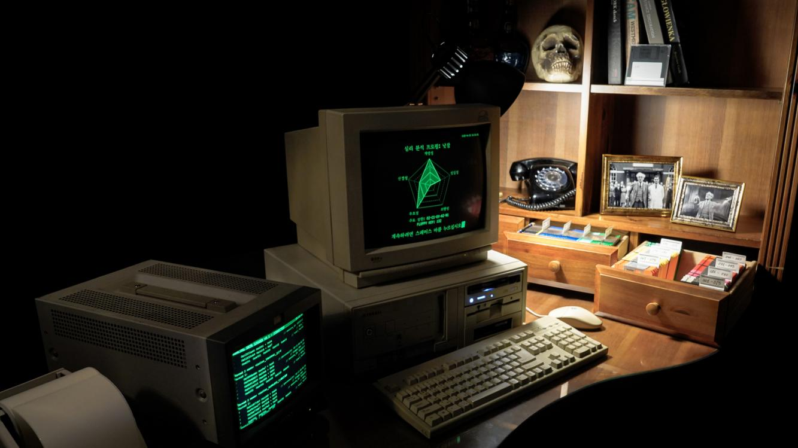

---

## 한눈에 보기

| 항목 | 내용 |
|---|---|
| 역할 | 전시 SW 전체 단독 개발 (약 4,100줄: `raemctrl_main.py` 3,816 + `log_server.py` 269) |
| 통합 장치 | 플로피 디스크 드라이브(개조 외장 리더), 라벨 프린터, OBS(WebSocket), 보조 CRT 로그 스크린 |
| 운영 실적 | 졸업전시 3일, 관람객 449명 세션 무중단 처리 (세션 로그 기준) |
| 신뢰성 설계 | 네트워크 자동 재연결(3초 백오프) · 전송 큐 백프레셔(maxsize 100) · 워커 스레드 분리 |
| 핵심 스택 | Python, Pygame, OpenCV, socket(TCP), threading, obsws-python, pywin32, Pillow |

## Ræm이란

Ræm은 성격심리학의 Big Five 모델과 HTP 투사 검사를 결합해 인간의 무의식을 **162가지 성격 유형**으로 구조화하고 시각화하는 인터랙티브 미디어 아트다. 관람객은 "1950년대 런던에서 시작된 괴짜 무의식 연구소"라는 세계관 속에서 CRT 모니터로 심리 검사를 진행하고, 자신의 유형 번호가 적힌 **실제 플로피 디스크**를 영사기 모티프의 키오스크에 삽입해 무의식이 투사된 시각화 결과를 체험한다. 검사 결과지는 그 자리에서 라벨 프린터로 인쇄된다.

RAEMCTRL(전시 버전 v_5.1)은 이 전시의 소프트웨어 전부다 — 심리 검사 UI, 하드웨어 제어, 네트워크, 미디어 재생을 한 프로그램에서 담당한다.

| 162가지 유형별 콘텐츠 (AI 생성 스케치) | 세계관 소품: HTP&BIG5 검사 안내서·기록지 |
|---|---|
| 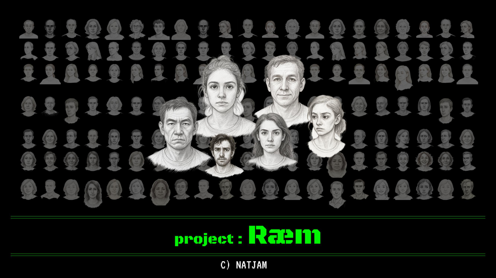 | 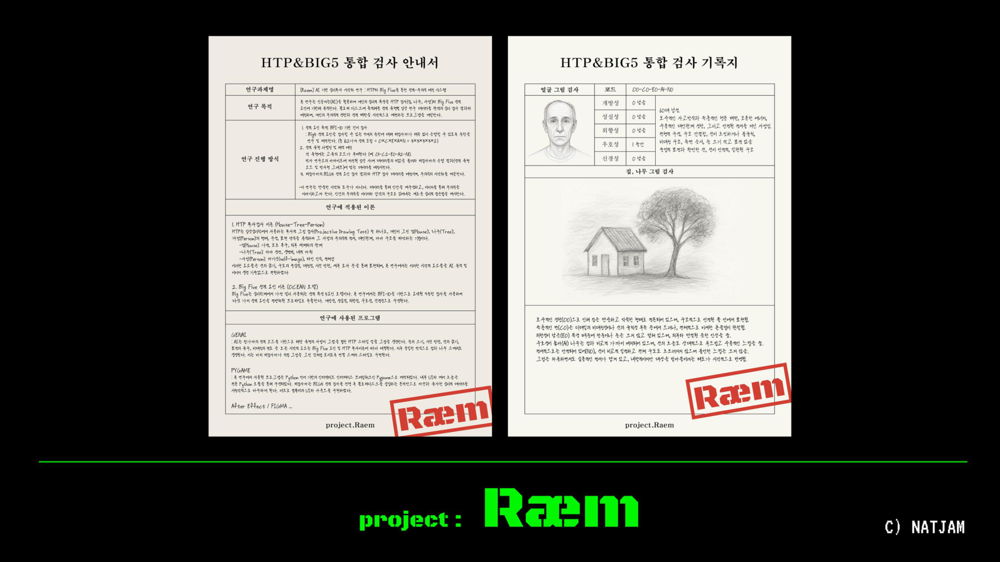 |

- 전시 작품 소개(Art-tech Showcase): [cau-artech-showcase.imweb.me/63](https://cau-artech-showcase.imweb.me/63)
- 전시 인스타그램: [@post](https://www.instagram.com/p/DLMFGFzzWbP/)

## 시스템 아키텍처

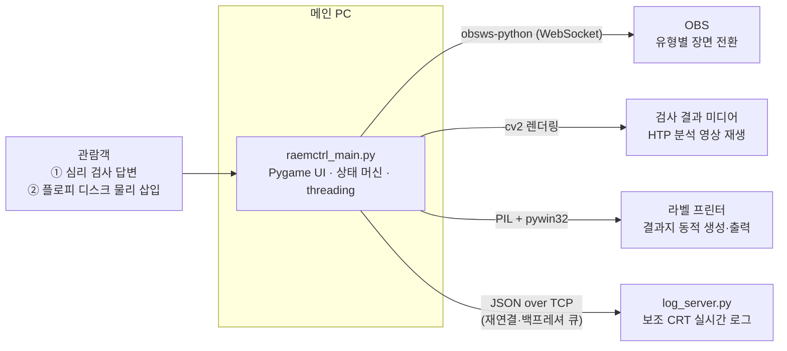

관람객의 입력(설문 답변, 플로피 삽입)이 메인 제어 앱으로 들어오면, 앱은 OBS 장면 전환 · 결과 영상 재생 · 결과지 인쇄 · 로그 송출 네 갈래의 출력을 동시에 조율한다.

**시스템 전체 아키텍처** — 메인 PC(Desktop 1)의 컴포넌트와 외부 하드웨어·로그 서버(Desktop 2)의 연결:

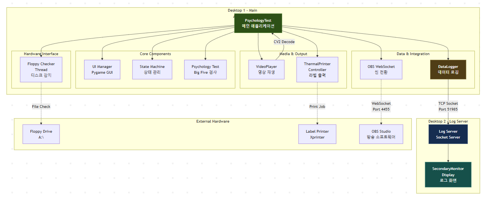

**클래스 구조** — 메인 앱은 `PsychologyTest`(상태 머신·이벤트 루프)를 중심으로 `DataLogger`(네트워크/파일 로그 큐·워커 스레드), `VideoPlayer`(cv2 프레임 재생), `ThermalPrinterController`(결과지 생성·인쇄)를 합성하고, 보조 PC의 `LogServer`가 `SecondaryMonitorDisplay`로 수신 로그를 렌더링한다:

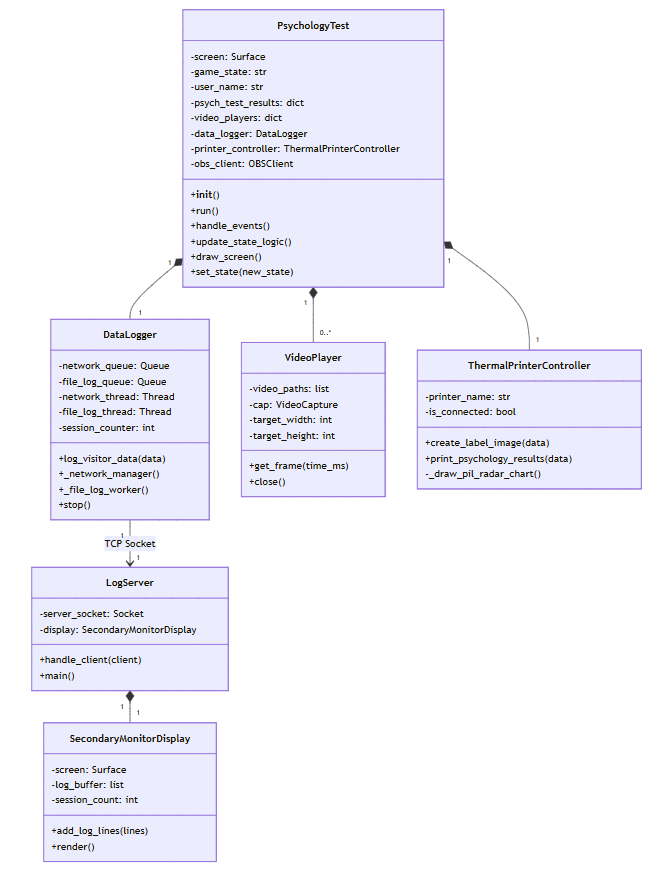

## 동작 흐름 (상태 머신)

전시 키오스크는 관람객이 어떤 순서로 조작해도 복구 가능해야 한다. 프로그램의 전 단계를 `STATE` 상수 기반 **상태 머신**으로 관리한다:

```
언어 선택 → 심리 검사(BFI-10 기반 설문) → 결과 산출·표시 → 플로피 디스크 안내 → 디스크 삽입 감지 → 유형별 콘텐츠 재생 → 초기화
```

| 부팅 화면 (v_5.1) | 검사 결과 — 성향 레이더 차트 + FLOPPY KEY |
|---|---|
| 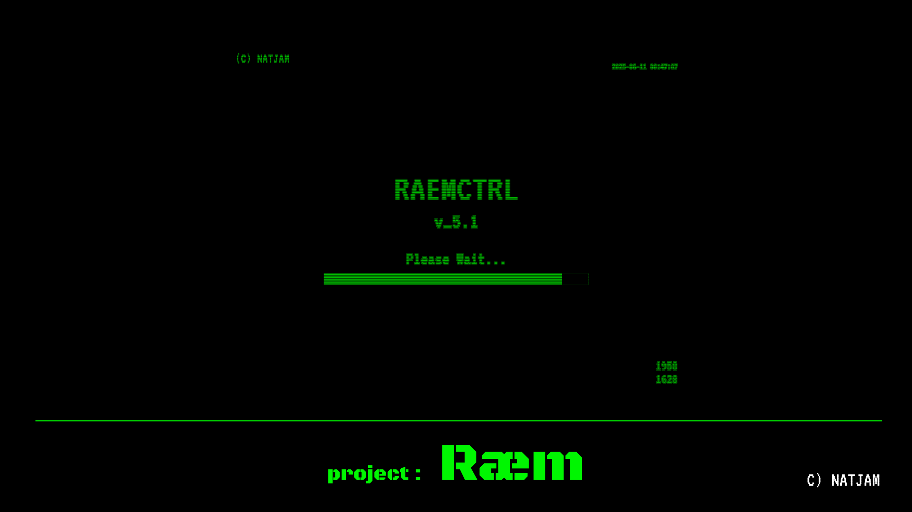 | 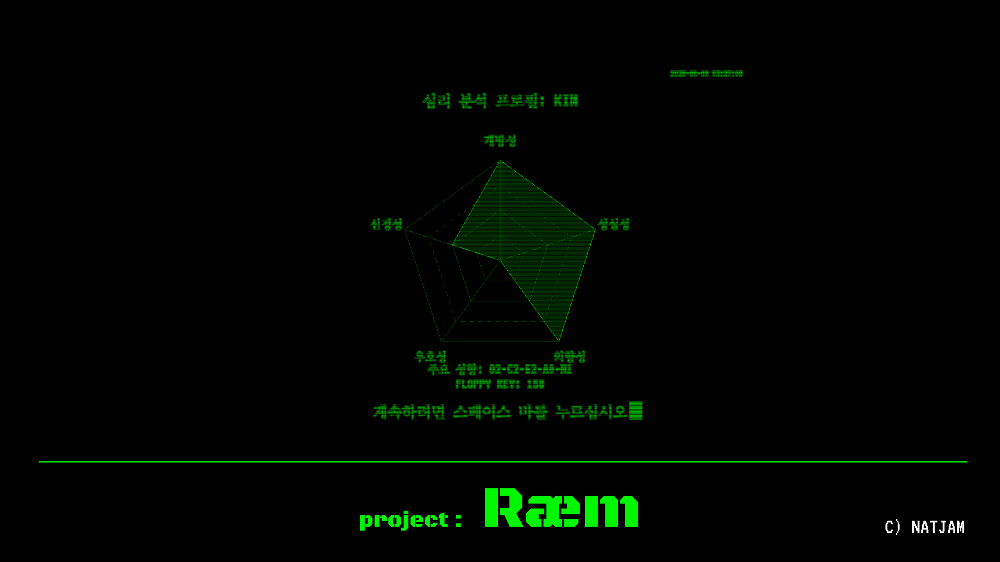 |

- **심리검사 엔진**: Big Five(개방성·성실성·외향성·우호성·신경성) BFI-10 기반 설문의 답변을 성향별 점수로 누적, 최종 조합(3×3×3×3×2)을 **162가지 성격 원형**에 매핑해 `O2-C1-E0-A2-N1` 형태의 성향 코드와 대응 FLOPPY KEY를 산출
- **결과 시각화**: 성향 점수를 레이더 차트로 렌더링 — 화면 표시는 Pygame, 인쇄용 결과지는 PIL(`_draw_pil_radar_chart`)로 각각 생성
- **플로피 프로토콜**: 디스크마다 내장된 key 값을 삽입 시점에 실시간 감지 → key-value 파싱 → 대응하는 유형별 영상·OBS 장면으로 분기

## 엔지니어링 하이라이트

### 1. 전시 3일 무중단을 위한 신뢰성 설계
전시장에서는 재부팅할 기회가 없다. 네트워크·주변장치 장애가 관람을 멈추지 않도록 설계했다.

- **자동 재연결**: 로그 서버와의 TCP 연결이 끊기면 3초 백오프로 백그라운드 재접속 — 메인 UI는 영향 없이 계속 동작
- **큐 백프레셔**: 로그 전송 큐 `maxsize=100`으로 메모리 폭주 방지, 전송은 워커 스레드가 전담해 UI 프레임과 분리
- **결과**: 3일 동안 관람객 449명 세션(로그 실측)을 다운타임 없이 처리

### 2. 이기종 장치 4종의 단일 앱 통합

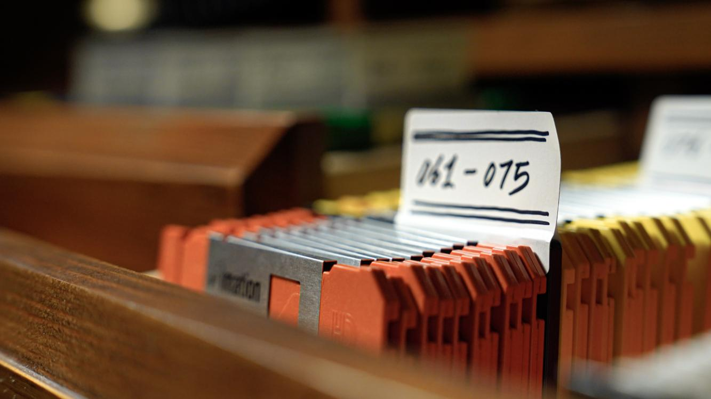

- **플로피 디스크 드라이브**: 구형 PC 타워를 개조한 외장 리더기(하드웨어 팀 제작)를 폴링해 삽입/제거와 디스크 내 key를 실시간 감지
- **라벨 프린터**: 검사 결과를 Pillow로 이미지 합성 후 pywin32로 즉석 인쇄
- **OBS**: obsws-python(WebSocket)으로 유형별 장면을 원격 전환
- **듀얼 스크린**: 세션 데이터(이름·타임스탬프·성향 점수)를 JSON으로 인코딩해 TCP로 보조 PC의 `log_server.py`에 송출, 별도 CRT에 실시간 시각화

### 3. CRT 레트로 렌더링 파이프라인
- 스캔라인, 빛 번짐(Glow), 화면 글리치 효과를 Pygame으로 직접 구현 — 메인 앱과 로그 서버 **양쪽 화면에 동일하게 적용**해 전시 전체의 시각 일관성 유지
- 언어 선택(한/영)과 텍스트 종류에 따라 폰트·크기를 동적으로 적용

### 4. 레거시 하드웨어 제약 위에서의 구동
전시 출력 장치는 실제 구형 CRT 모니터다. PC(GPU) 출력 신호를 HDMI → DVI → CGA로 변환하고 아날로그 주파수를 정합해 **640×480 @ 59.98Hz 고정**으로 CRT에 전송했다(신호 변환·기구 제작은 하드웨어 팀 담당). 소프트웨어는 이 저해상도·아날로그 변환 환경을 전제로 해상도와 렌더링을 설계했다.

| 신호 변환 체인 | 전시 키오스크 (CRT + 개조 플로피 리더) |
|---|---|
| 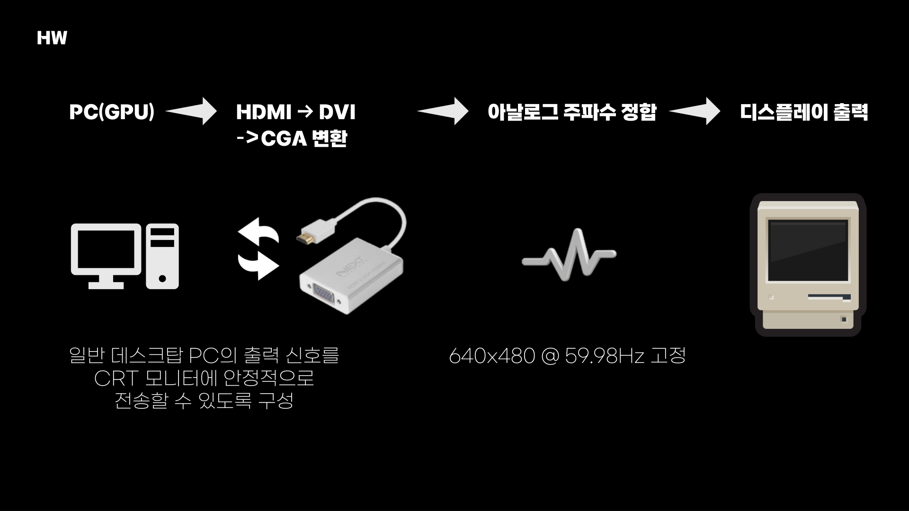 | 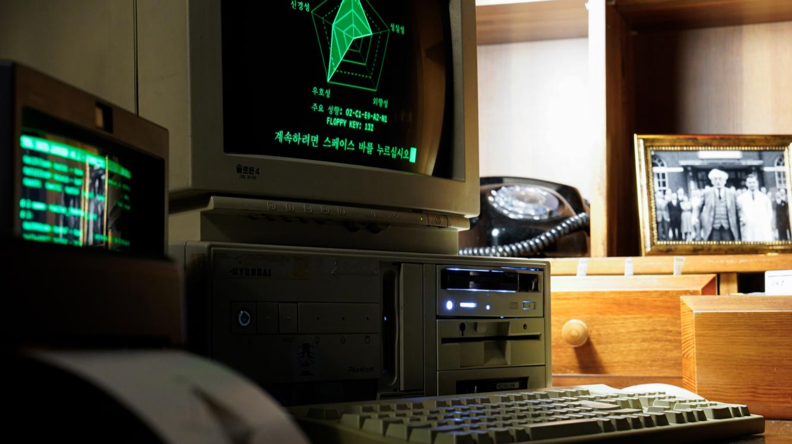 |

## 컴퓨터 비전: 사전 HTP 데이터 분석

162가지 유형별 콘텐츠의 기반이 된 사전 HTP 투사 검사 스케치 데이터는 객체 인식 딥러닝 모델로 분석했다(스케치에서 head/face/eye/ear/nose 등 요소 검출). 이 모델 개발의 전체 실험 기록(YOLOv8/11 → RT-DETR → ResNet50, 약 15.5k줄)은 자매 레포에 보존되어 있다:

**→ [raemctrl-sketch-vision-model-archive](https://github.com/jkwltx177/raemctrl-sketch-vision-model-archive)**

## 기술 스택

| 분류 | 사용 기술 |
|---|---|
| 언어 | Python 3 |
| UI/렌더링 | Pygame (커스텀 CRT 이펙트), screeninfo |
| 영상/이미지 | OpenCV, numpy, Pillow |
| 네트워크 | socket (TCP), JSON 직렬화, threading + queue |
| 장치 연동 | obsws-python (OBS WebSocket), pywin32 (프린터·드라이브) |

## 프로젝트 구조

```
raemctrl/
├── raemctrl_main.py   # 메인 제어 앱 (3,816줄): 상태 머신, 검사 UI, 장치 제어, 로그 송출
├── log_server.py      # 보조 스크린 로그 서버 (269줄): TCP 수신, CRT 스타일 실시간 시각화
├── docs/images/       # README 이미지 (전시 사진, 아키텍처 다이어그램, GUI 캡처)
├── fonts/             # CRT UI 폰트 (VT323, Courier Prime)
├── ref-images/        # 참고 이미지
├── sounds/            # 부팅음, 플로피 삽입음, 타이핑음 등 전시 사운드
└── requirements.txt
```

## 실행 방법

```bash
pip install -r requirements.txt
```

1. 보조 PC에서 로그 서버 실행:
   ```bash
   python log_server.py
   ```
2. 메인 PC에서 환경변수 설정 후 메인 앱 실행:
   ```bash
   # 로그 서버 연결 (미설정 시 127.0.0.1:51985)
   set RAEM_LOG_SERVER_HOST=<로그 서버 IP>
   set RAEM_LOG_SERVER_PORT=51985

   # OBS WebSocket 연결 (미설정 시 localhost:4455)
   set RAEM_OBS_HOST=<OBS 호스트>
   set RAEM_OBS_PORT=4455
   set RAEM_OBS_PASSWORD=<OBS WebSocket 비밀번호>

   python raemctrl_main.py
   ```

모든 접속 정보는 환경변수로 주입하며 코드에 하드코딩하지 않는다.

## 프로젝트 정보

- **전시**: 중앙대학교 예술공학부 졸업전시 — 3일간 관람객 449명
- **수상**: 중앙대학교 2025 SW·AI 캡스톤디자인 경진대회 **장려상**
- **팀 구성**: 4인 (기획/AI·아트 디렉팅, 하드웨어, 영상, 소프트웨어) — 본 레포의 소프트웨어 전체는 1인 단독 개발
- **향후 계획**: 모듈 분리 리팩토링, 설정 파일 외부화, 전시 재운영 대비 셋업 문서화
